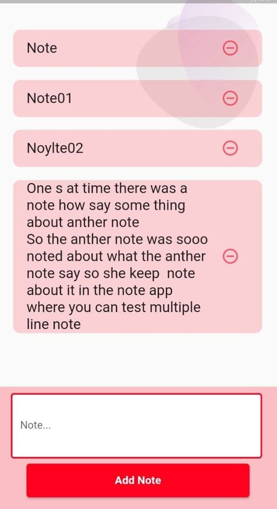
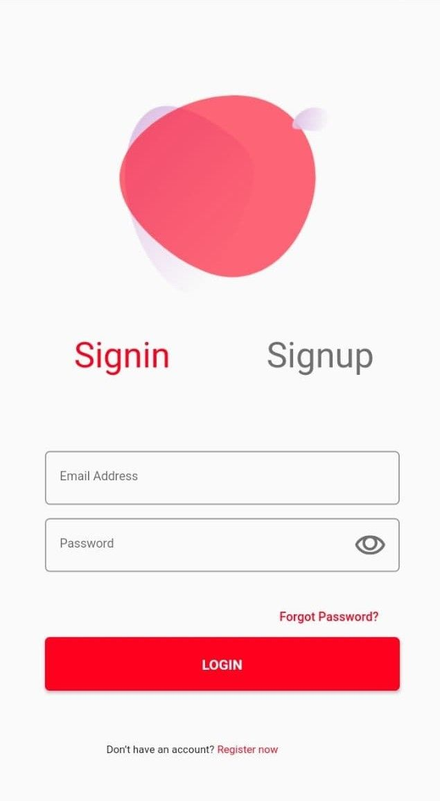

# note-app-api-mobile
end-to-end note application
## API
- Golang for the web application 
- MongoDB for the database
- [PostMan requests Collection](https://github.com/Kareem21227gg/note-app-api-mobile/blob/master/go-note-app.postman_collection.json)
## Flutter
simple app contains two pages:
- note page (view, add, delete, log out)
- sign page (sign in, sign up)

## Screenshots 
<table>
  <tr>
     <td>note page</td>
     <td>sign page </td>
    
  </tr>
  <tr>
    <td></td>
    <td></td>
     </tr>
 </table>

